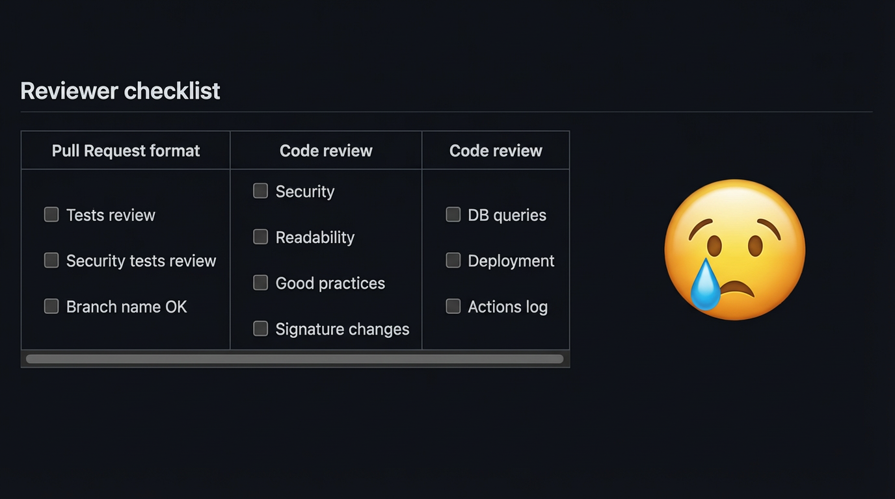
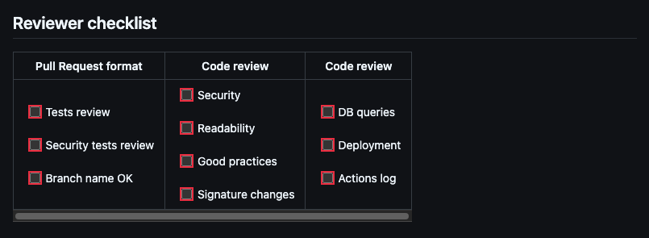

# Do Not Forget Checklist

Do Not Forget Checklist is a Chrome extension for GitHub pull requests.  
It highlights checklist items that are still not checked.  
This helps reviewers and authors quickly see what is still missing.

## How to Install on Chrome

1. Download or clone this project on your computer.
2. Open Chrome and go to `chrome://extensions`.
3. Turn on **Developer mode** (top-right).
4. Click **Load unpacked**.
5. Select the project folder: `do-not-forget-checklist`.
6. Open a GitHub pull request page and check that the extension is active.

